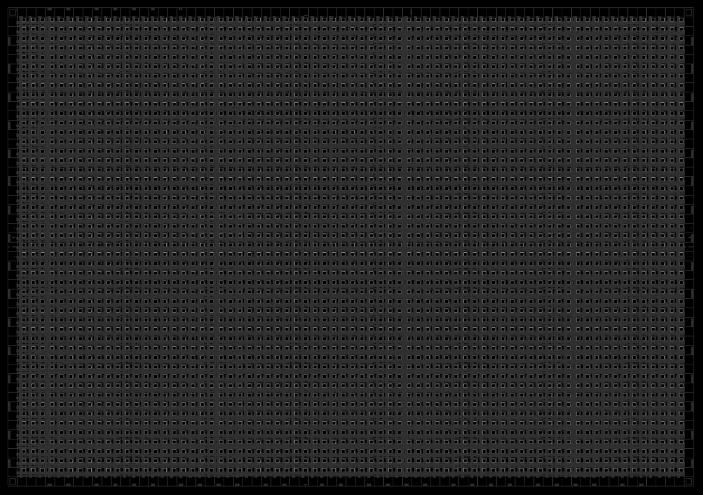
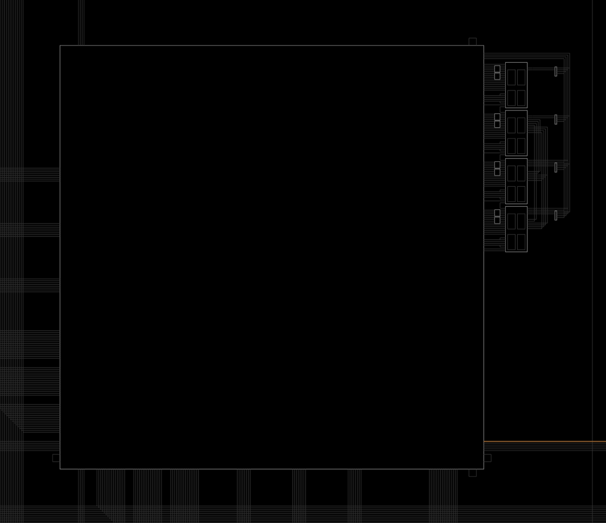
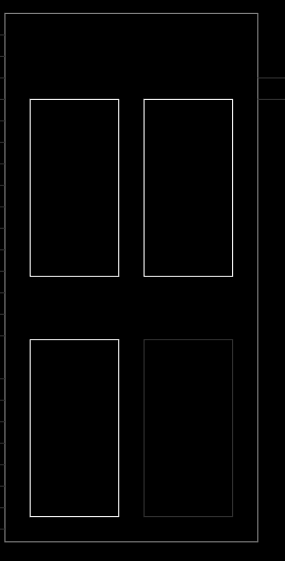

+++
title = "ECP5 in details"
weight = 4
+++

## Main view
This is a symbolic representation of the ECP5 chip on your i5 board (from nextpnr-ecp5 --gui)

## PFU blocks
Each of those numerous squares is a what is called a PFU block:

## Slices

And each of these blocks contain 4 slices:

And each of those slices contain 2 LUT4s and 2 registers. They can take multiple configurations like a block of RAM (SRAM), or ROM or be combined to make LUT5,6,7 or 8.

## LUTs

Let's see what a LUT is.

LUT is short for Look-up table. A LUT is a small memory with an address decoder. A LUTn will have 2^n memory cells. So a LUT4 will have 16 memory cells. With 4 wires as its inputs, it can then store 16 different values.

To make a XOR gate you would program a LUT2 as such:
| A0 | A1 | Output |
|----|----|--------|
| 0  | 0  | 0      |
| 0  | 1  | 1      |
| 1  | 0  | 1      |
| 1  | 1  | 0      |

The slices usually contain complex routing systems that allow connecting the LUT, registers and other components of the slice together in various ways.

These are the kind of functions that a single slice can do in an ECP5:

- Addition 2-bit
- Subtraction 2-bit
- Add/Subtract 2-bit using dynamic control
- Up or Down counter 2-bit
- Up/Down counter with asynchronous clear
- Up/Down counter with preload (sync)
- Ripple mode multiplier building block
- Multiplier support
- Comparator functions of A and B inputs
- A greater-than-or-equal-to B
- A not-equal-to B
- A less-than-or-equal-to B

Implementing RAM in an FPGA is pretty costly. To implement 16x4 bits of SRAM, you need 3 slices. For DPRAM (RAM that can be written or read at the same time by two entities), you need 6 slices. That's why FPGAs often include specific blocks of RAM (BRAM) to reduce the area. 

The ECP5 on the i5 (LFE5U-25) is one of the small ones. It has 24K LUTs, 56 blocks of 18 Kbits of system memory (fully enclosed memory system that can do dual port and have their own clocks). 1008 Kbits of embedded memory. 194 Kbits of distributed ram.

It also contains 28 hardware multipliers (18bits by 18 bits).

There are also more advances DSP cores (sysDSP) but they are not handled yet by the OSS tools. If you are interested in helping with the reverse engineering of that, I'm sure the world of ECP5 users would love you very much.

## Clocks
-    sysCLOCK PLLs: The ECP5 FPGA contains four sysCLOCK Phase-Locked Loop (PLL) modules, which can generate a wide range of output frequencies and phase relationships from a single input clock source. They provide flexible clock generation and conditioning features such as frequency synthesis, clock phase shifting, and clock duty cycle control. There are two of those in the ECP5 you have.

-    DDR-PLLs: In addition to the sysCLOCK PLLs, the ECP5 FPGA also contains two DDR-PLLs specifically designed for high-speed DDR memory interfaces, ensuring accurate clocking for memory operations. There are two of those in the ECP5 you have.

-    Global Clock Buffers (GCBs): ECP5 FPGA devices feature a global clock network comprising GCBs. These buffers are responsible for distributing low-skew, low-jitter clock signals throughout the FPGA fabric. They help reduce clock skew and minimize clock-to-clock and clock-to-data signal delays.

-    Clock Multiplexers (MUXes): Clock MUXes are used to select between multiple clock sources for a specific logic element or resource in the FPGA. This allows designers to optimize power consumption and performance by selecting the appropriate clock source for different parts of the design.

-    Clock Dividers: The ECP5 FPGA also features clock dividers that allow designers to generate multiple, slower clock signals from a single high-speed clock source. This helps in reducing power consumption and optimizing performance for specific logic elements or resources.

-    Enhanced Logic Array Blocks (E-LABs): E-LABs are the basic building blocks of the ECP5 FPGA, containing programmable logic elements, registers, and memory resources. Each E-LAB can be independently clocked, providing fine-grained control over clock distribution and enabling efficient power management.

 -   Dynamic Clock Gating: The ECP5 FPGA supports dynamic clock gating, which allows designers to selectively enable or disable clock signals to specific regions of the FPGA fabric, reducing power consumption when parts of the design are idle.

-    Clock and Data Recovery (CDR) circuits: These are used in high-speed serial interfaces such as SERDES to recover clock signals embedded in data streams, ensuring proper synchronization between the transmitter and receiver. But in the ECP5 chip of the colorlight i5 there is no SERDES.
