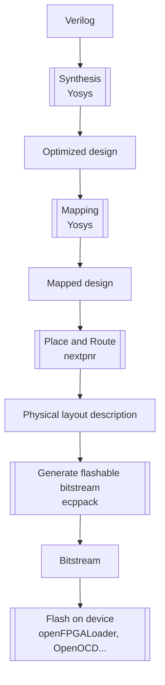

+++
title = "Verilog to bitstream - detailed process"
menutitle = "Verilog to bitstream"
weight = 1
+++

This was in a huge part generated from GPT4. Don't hesitate to contact us about mistakes and errors.

Looks like GPT stole a lot from the Lattice ECP5 manual and obviously made no attributions.

I took some stuff from the great presentation by Claire Xenia Wolf on Yosys: https://github.com/YosysHQ/yosys-manual-build/releases/download/manual/presentation.pdf

## Overview
Digital circuits can be described at different levels of abstraction:

- System level : Overall description of the system
- High level : Mostly for humans, that's how we code in Python, Java, Ruby...
- Behavioral level : A cycle-accurate description of the hardware (Verilog, VHDL...)
- Register-Transfer level : Lists of operations that allow the system to go from one state to another
- Logical gate level : Single bit description of the system (can be a bunch of NANDs or more complex)
- Physical gate level : Mapping of the system on a physical device that can use its specific computing units (LUTs, multipliers, divisers...)
- Switch level : Transistor description

LiteX will convert High level to Behavioral level
Yosys handles everything from Behavioral level to Physical gate level.
This then all gets placed by nextpnr on the chip itself trying to satisfy the user constraints of speed, performance or area (in the FPGA world we don't talk about space of a "program" we talk about area on the die).

## From system description to configuration

The process of converting Verilog or VHDL code to a bitstream for an FPGA involves several steps. These steps are broadly similar for different FPGAs and toolchains, but here are the details for  the Lattice ECP5 FPGA and open-source tools like Yosys and Project Trellis:

1.  High-level synthesis (HLS): This step involves converting the high-level Verilog or VHDL code into a lower-level representation that can be more easily optimized and mapped to the FPGA's resources. Yosys is an open-source synthesis tool that can take Verilog or VHDL code (using the GHDL plugin) as input and perform HLS.
2.  Optimization: Yosys will perform various optimizations on the code, such as constant propagation, dead code elimination, and technology mapping. This helps to reduce the complexity of the design and make it more suitable for the target FPGA.
3.  Mapping to FPGA resources: The optimized design is then mapped to the specific resources available on the target FPGA, such as LUTs (Look-Up Tables), flip-flops, and other specialized components like DSP blocks and memory blocks. In the case of the ECP5 FPGA, this step is performed by Yosys using the "synth_ecp5" command, which maps the design to the ECP5's resources.
4.  Place and Route (P&R): Once the design is mapped to the FPGA's resources, the next step is to determine the physical placement of these resources on the FPGA and the interconnect routing between them. This is a critical step, as the placement and routing can significantly impact the performance and resource utilization of the design. Nextpnr is an open-source P&R tool that can be used with the ECP5 FPGA, and it works in conjunction with Project Trellis, which provides a database of the ECP5's architecture and bitstream format.
5.  Bitstream generation: After the P&R process, the final step is to generate the bitstream that will configure the FPGA to implement the design. This bitstream is a binary file that contains the configuration data for the FPGA's resources and interconnects. Nextpnr and Project Trellis work together to generate the bitstream for the ECP5 FPGA. The "nextpnr-ecp5" command is used to run the Nextpnr tool, which takes the output from Yosys and generates a bitstream using the Project Trellis database.
6.  Programming the FPGA (configuration): Once the bitstream is generated, it can be programmed onto the ECP5 FPGA using an appropriate programming tool. For example, the open-source tool OpenOCD can be used to program the FPGA via a JTAG interface.

### High-level synthesis
High-Level Synthesis (HLS) is the process of converting a high-level hardware description language (HDL) design, such as Verilog or VHDL, into a lower-level representation that is suitable for further optimization and mapping to an FPGA or ASIC. The primary goal of HLS is to generate an optimized, technology-independent representation of the design that can be more easily mapped to the target hardware.

HLS involves several sub-processes, including:

1.  Parsing: The first step in HLS is parsing the input HDL code to create an internal representation of the design. This internal representation is typically an abstract syntax tree (AST) or a similar data structure that captures the structure of the HDL code, including its modules, instances, and hierarchy.
2.  Elaboration: The next step is elaboration, which involves resolving the design hierarchy, parameterization, and instantiation of modules. The elaboration process creates a flattened representation of the design by expanding instantiated modules and resolving their interconnections. This step is important for analyzing and optimizing the design at the module level and below.
3.  Behavioral synthesis: Behavioral synthesis focuses on converting the behavioral descriptions of the design (i.e., the algorithmic or functional specifications) into a structural representation that can be more easily optimized and mapped to hardware resources. This process typically involves converting high-level constructs such as loops, conditional statements, and arithmetic operations into a dataflow graph or a control-data flow graph (CDFG). These graphs represent the design at a lower level of abstraction and expose opportunities for optimizations such as pipelining, loop unrolling, and resource sharing.
4.  Scheduling: Scheduling is the process of assigning operations in the design to specific time steps or clock cycles. This is a critical step in HLS because it determines the latency, throughput, and resource utilization of the design. Scheduling can be performed using various algorithms, such as ASAP (As Soon As Possible), ALAP (As Late As Possible), or more sophisticated techniques that take into account resource constraints and performance goals.
5.  Resource allocation and binding: Once the operations have been scheduled, the next step is to allocate and bind the required hardware resources, such as functional units (adders, multipliers, etc.), registers, and memories. The resource allocation and binding process involves assigning each operation in the design to a specific functional unit and determining the mapping of variables to registers or memory. This step has a significant impact on the area and power consumption of the final implementation.
6.  RTL generation: After the scheduling, resource allocation, and binding processes, the HLS tool generates a Register-Transfer Level (RTL) representation of the design. The RTL representation is a lower-level description of the design that can be more easily mapped to an FPGA or ASIC. It typically consists of a netlist of interconnected registers, functional units, and multiplexers, along with the associated control signals.

The output of the HLS process is an optimized RTL design that can be further processed by downstream tools, such as logic synthesis, technology mapping, and place-and-route. The primary advantage of using HLS is that it allows designers to work at a higher level of abstraction, which can improve productivity and enable more complex designs. However, HLS tools may not always generate the most optimized implementations, and manual RTL coding or optimization may still be required for certain designs or performance-critical components.

#### Optimization

The optimization stage is a crucial part of the process of converting high-level hardware descriptions into a lower-level representation that can be mapped onto FPGAs or ASICs. During optimization, the design is transformed and refined to meet performance, area, and power goals, while ensuring that the functional requirements are maintained. This stage typically involves several types of optimizations, including:

1.  Constant propagation: This optimization identifies and simplifies expressions containing constants, replacing them with their constant values. This can help reduce the complexity of the design and eliminate unnecessary logic gates.
2.  Dead code elimination: Dead code refers to portions of the design that have no impact on the output or are never executed. Dead code elimination identifies and removes such redundant parts of the design, which helps to save area and power by eliminating unnecessary resources.
3.  Boolean simplification: This optimization applies Boolean algebra rules to simplify the logic expressions in the design, reducing the number of gates and interconnections. This can help to minimize the area and delay of the resulting implementation.
4.  Algebraic simplification: This technique simplifies arithmetic expressions in the design, by applying algebraic identities and arithmetic properties. For example, multiplication by a power of two can be replaced with a shift operation, which is typically more efficient in hardware.
5.  Common subexpression elimination: This optimization identifies and eliminates redundant computations in the design by reusing the results of identical subexpressions. This can help to reduce the overall complexity of the design and save hardware resources.
6.  Technology mapping: Technology mapping transforms the design into a representation that is compatible with the target FPGA or ASIC technology. This involves mapping the design to the specific resources available on the target device, such as Look-Up Tables (LUTs), flip-flops, and other specialized components like DSP blocks and memory blocks. Technology mapping also optimizes the design for the target technology by selecting the most suitable primitives and resource configurations.
7.  Retiming: Retiming is an optimization technique that moves registers across combinational logic boundaries to improve performance or reduce area. This can help to balance the pipeline stages or critical paths, which can improve the overall performance of the design.
8.  Resource sharing: This optimization technique identifies opportunities to share hardware resources among multiple operations or instances, which can help to save area and power. This is particularly important when mapping the design to an FPGA, where resources such as DSP blocks and memories are limited.

These optimization techniques can be applied in various orders and combinations, depending on the specific design and optimization goals. Some optimizations may be more suitable for certain types of designs or target technologies, and trade-offs may need to be made between performance, area, and power.

In the context of open-source tools like Yosys, many of these optimizations are performed automatically as part of the synthesis process. However, the user can also control or fine-tune the optimizations through various command-line options or synthesis scripts. It is essential to understand and apply the appropriate optimizations to achieve the desired design goals while maintaining the functional requirements of the design.

### Mapping
Mapping to FPGA resources is the process of converting the optimized design representation (typically at the Register-Transfer Level, or RTL) into a form that is compatible with the specific resources available on the target FPGA. This process involves determining how the design's logic functions, storage elements, and other components can be efficiently implemented using the FPGA's resources. Some of the key resources available on FPGAs include:

1.  Look-Up Tables (LUTs): LUTs are the primary building blocks of FPGAs, used to implement combinational logic functions. They are essentially small, programmable memory elements that can generate any desired logic function of their inputs. LUTs usually have a fixed number of inputs (e.g., 4-input, 6-input) and can be cascaded or combined to implement more complex functions.
2.  Flip-flops (FFs): Flip-flops are used to store state information in the design, providing synchronous storage elements for implementing registers, counters, and state machines. FPGAs typically have dedicated flip-flops associated with each LUT, which can be configured to store the output of the LUT or to bypass the LUT and store an external signal.
3.  Block RAM (BRAM): BRAM is a dedicated memory resource available on FPGAs, used to implement larger memory structures such as buffers, caches, and lookup tables. BRAMs can be configured to support different widths and depths, and multiple BRAMs can be combined to create larger memory structures.
4.  Digital Signal Processing (DSP) blocks: DSP blocks are specialized resources available on many FPGAs for implementing arithmetic functions, such as multipliers, adders, and accumulators. They are designed to provide higher performance and lower power consumption compared to equivalent implementations using LUTs and flip-flops.
5.  Input/Output (I/O) blocks: I/O blocks are the interface between the FPGA and external signals. They can be configured to support various I/O standards, voltages, and drive strengths. I/O blocks also often include support for specialized functions, such as clock input and output, analog-to-digital conversion, and high-speed serial interfaces.

During the mapping process, the design's components are assigned to specific FPGA resources, and the interconnections between these resources are established. This involves:

1.  Logic synthesis: The RTL design is transformed into a gate-level netlist, which is a representation of the design in terms of gates, flip-flops, and other low-level primitives. This step may involve additional optimizations, such as constant propagation, Boolean simplification, and resource sharing.
2.  Technology mapping: The gate-level netlist is mapped to the specific resources available on the target FPGA, such as LUTs, flip-flops, and DSP blocks. This step involves selecting the most suitable FPGA primitives and configurations to implement the design's components while optimizing for performance, area, and power.
3.  Packing: Packing is the process of grouping the mapped components into larger structures called "tiles" or "clusters" that correspond to the physical resources on the FPGA. For example, LUTs and flip-flops can be packed together into "slices," which are the basic building blocks of many FPGAs. Packing can help to improve the utilization of FPGA resources and reduce the complexity of the place-and-route process.

In the context of the Lattice ECP5 FPGA and open-source tools like Yosys, the mapping process is performed using the "synth_ecp5" command, which performs logic synthesis and technology mapping specifically for the ECP5's resources. Once the design is mapped to the ECP5's resources, it can be passed to the next stage of the implementation process, which is the place-and-route (P&R) step using tools

### Place and Route (PNR)
Place and Route (P&R) is a critical stage in the FPGA or ASIC implementation process, following the mapping of the design to the target device's resources. The primary goal of P&R is to determine the physical placement of the design's components on the FPGA or ASIC and the interconnect routing between them. The quality of the P&R process has a significant impact on the performance, area, and power consumption of the final implementation. P&R involves two main sub-processes:

1.  Placement: The placement step determines the physical locations of the design's components (such as LUTs, flip-flops, and DSP blocks) on the FPGA or ASIC. The objective is to find an optimal placement that minimizes the total wirelength, reduces congestion, and meets performance (timing) constraints. The placement process can be guided by various algorithms, such as simulated annealing, genetic algorithms, or analytical techniques. During placement, the tool also takes into account the target device's architecture, including the arrangement of resources, the available routing resources, and any other constraints, such as fixed locations for specific components (e.g., I/O pins or clock resources).
2.  Routing: After the components have been placed, the routing step determines the interconnect paths between them, using the available routing resources (such as routing channels, switches, and wire segments) on the FPGA or ASIC. The goal of the routing process is to find a congestion-free and timing-optimized routing solution that satisfies the design's performance requirements and minimizes power consumption. Routing can be performed using various algorithms, such as pathfinder, negotiated congestion, or iterative rip-up and reroute techniques.

P\&R tools often use a cost function or objective function to guide the optimization process and evaluate the quality of the placement and routing solutions. This function may take into account various factors, such as wirelength, congestion, timing, area, and power consumption. The P&R tool iteratively refines the placement and routing solutions to minimize the cost function, subject to the design constraints and target device's architectural constraints.

In the context of the Lattice ECP5 FPGA and open-source tools, Nextpnr is a commonly used P&R tool, which works in conjunction with Project Trellis. Project Trellis provides a database of the ECP5's architecture and bitstream format, enabling Nextpnr to perform P&R specifically for the ECP5 FPGA. To run Nextpnr for ECP5, the "nextpnr-ecp5" command is used, which takes the mapped design output from Yosys as input and generates a placed and routed design suitable for bitstream generation.

During the P&R process, the tool generates various reports and visualizations that help designers analyze the quality of the placement and routing solutions and identify any issues or bottlenecks. These reports may include information about the utilization of FPGA resources, the distribution of wirelengths, the critical path delays, and the timing slack. Designers can use this information to guide further optimization or refinement of the design, either at the RTL level, during the mapping process, or by adjusting P&R constraints and settings.

### Bitstream generation

Bitstream generation is the final stage in the FPGA implementation process, following the successful completion of the Place and Route (P&R) step. The bitstream is a binary file that contains the configuration data required to program the FPGA with the designed hardware. This data includes the settings for the FPGA's programmable resources, such as Look-Up Tables (LUTs), flip-flops, memory blocks, and interconnect routing. The bitstream generation process involves converting the placed and routed design into a format that can be loaded onto the FPGA to configure its resources.

During bitstream generation, the following steps are typically performed:

1.  Design translation: The placed and routed design is translated into a device-specific representation that includes the settings for the FPGA's programmable resources. This step involves mapping the design's components and interconnects to the specific configuration elements of the target FPGA, such as configuration memory cells, programmable switches, and routing multiplexers.
2.  Bitstream assembly: The translated design is assembled into a bitstream, which is a sequence of binary data that represents the configuration settings for the FPGA's resources. The bitstream is organized according to the target FPGA's programming interface and memory organization, and may include additional data, such as error detection codes, synchronization patterns, or configuration commands.
3.  Bitstream compression (optional): Some FPGA vendors and tools support bitstream compression, which can help to reduce the size of the bitstream and the time required to program the FPGA. Bitstream compression typically involves applying lossless compression algorithms, such as Run-Length Encoding (RLE) or Huffman coding, to the configuration data.
4.  Bitstream encryption and authentication (optional): In order to protect intellectual property or ensure the security of the design, some FPGA vendors and tools support bitstream encryption and authentication. This involves encrypting the bitstream using a cryptographic algorithm (such as AES) and a secret key, and/or adding an authentication code (such as an HMAC) to the bitstream. The FPGA's programming interface must support the corresponding decryption and authentication mechanisms to load the encrypted or authenticated bitstream.

In the context of the Lattice ECP5 FPGA and open-source tools, the bitstream generation process is performed using the Project Trellis tools. After the P&R step with Nextpnr, the output is a JSON file that represents the placed and routed design. This file is then passed to the "ecppack" tool, which is part of the Project Trellis suite, to generate the final bitstream. The "ecppack" tool translates the design's components and interconnects into the ECP5's configuration elements and assembles the bitstream according to the ECP5's programming interface and memory organization.

Once the bitstream is generated, it can be loaded onto the target FPGA using a programming tool or interface, such as JTAG, SPI, or an embedded configuration memory. The FPGA reads the bitstream and configures its programmable resources according to the design's settings, thereby implementing the desired hardware functionality.

