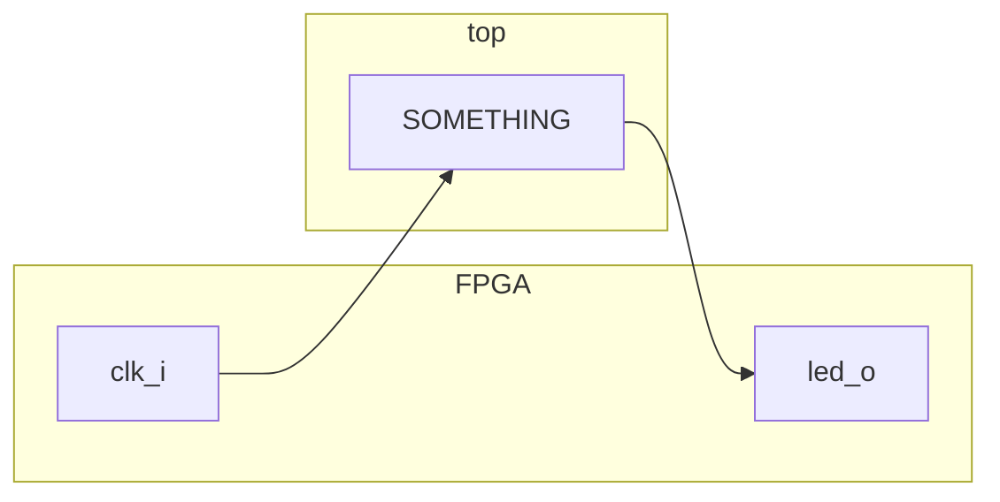
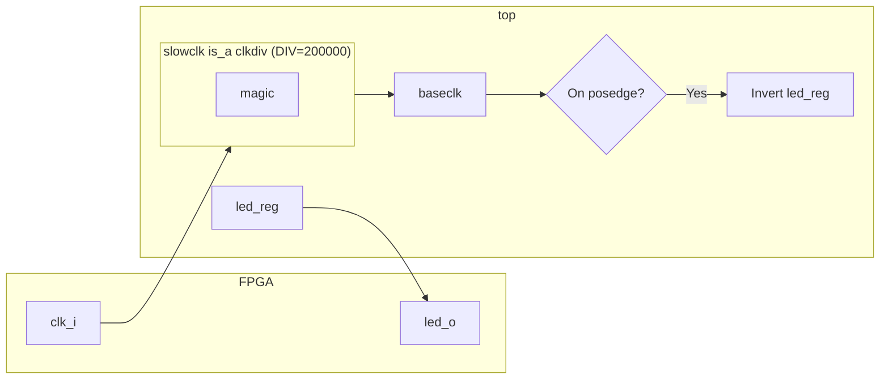
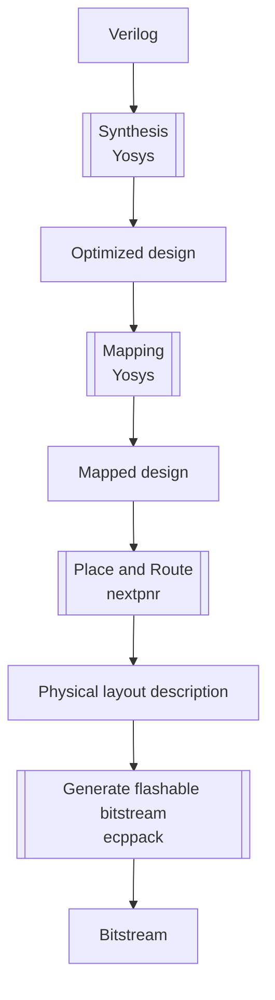

+++
title = "01 - Blink"
weight = 1
+++

Blinky is the "Hello world" of FPGAs

The code is in code/lesson_01

This is probably the simplest code you can use on an FPGA that will generate something you can see working.

## How code is organized
### Verilog
We have a verilog file. Verilog is a High-level description language that allows us to describe how we want the FPGA to react to specific logic signals.
```verilog
module top(input clk_i, output led_o);
   reg  led_reg;
   wire baseclk;

   clkdiv #(.DIV(200000)) slowclk (clk_i, baseclk);

   always @(posedge baseclk) begin;
      led_reg <= !led_reg;
   end

   assign led_o = led_reg;
endmodule


module clkdiv #(parameter DIV = 24'd5000)(
    input wire clk_i,
    output wire clk_o
    );

    reg [24:0] count = 25'b0;
    reg clk_o_internal = 1;
    //on this board we have a 25MHz clock

    always @(posedge clk_i) begin
        count <= count + 25'b1;
        if(count == DIV) begin
            count <= 25'b0;
            clk_o_internal <= ~clk_o_internal;
        end
    end
    assign clk_o = clk_o_internal;
endmodule
```

It looks scary but let's try to decompose it


We have some magic logic that takes a **clk_i**, transforms it and sends that to **led_o**.

### LPF file

Now we also need to tell whatever will interpret that verilog, this is what **clk_in** and **led_o** are. That's the role of the LPF file (Lattice Preference File), this file will link your human name to specific pins or internal lines inside the chip.

```
LOCATE COMP "clk_i" SITE "P3";
IOBUF PORT "clk_i" IO_TYPE=LVCMOS33;
FREQUENCY PORT "clk_i" 25 MHZ;

LOCATE COMP "led_o" SITE "U16";
IOBUF PORT "led_o" IO_TYPE=LVCMOS25;
```

We are taking the pad P3 of the FPGA (site definition), saying it has a 3V3 CMOS level (LVCMOS33) and that it is a frequency type port that's receiving a 25MHz clock.

And we are saying the U16 is a 2.5V CMOS level GPIO.

## Digging into "SOMETHING"
We will ignore the details of clkdiv for that lesson and do something people programming FPGA love: making abstractions and ignoring the implementation details. In practice unfortunately you often have to go dig in implementations for performance, size of power consumption reasons.

```verilog
module top(input clk_i, output led_o);
   reg  led_reg;
   wire baseclk;

   clkdiv #(.DIV(200000)) slowclk (clk_i, baseclk);

   always @(posedge baseclk) begin;
      led_reg <= !led_reg;
   end

   assign led_o = led_reg;
endmodule
```

Lets decypher that:
```verilog
module top(input clk_i, output led_o);
endmodule
```

This is declaring a module named top (mandatory in Yosys, that's the start of everything) that has one input clk_i and one output led_o. All things in Verilog are divided like that so blocks can be reused and reimplemented easily. You could think of them as "functions" for now (even if the reality is slightly more complex).

```verilog
	reg led_reg;
    wire baseclk;
```

Here we are talking about two essential entities of Verilog, **reg** or registers which are ways to store information.
And **wires** which are how blocks are connected to each other. 

```verilog
	clkdiv #(.DIV(200000)) slowclk (clk_i, baseclk);
```

Here we are instanciating a clkdiv block called slowclk. It takes clk_i and baseclk are what we call "nets" they are the connections to and from the module. And we set the parameter DIV to the value 200000. What this module does is dividing the input clock on clk_i by the DIV value and outputing that to baseclk. In our case clk_i is 25MHz, we divide by 200000 so we get a 125Hz output clock.

```verilog
   always @(posedge baseclk) begin;
      led_reg <= !led_reg;
   end
```

Now we are getting into the reality of FPGAs. Things are working in a synchronous way, but not as you see it in a computer where everything is directed by a single clock. In an FPGA you can have dozens or more clocks in your different modules, a single module can use multiple clocks etc. This the most difficult thing to grasp and solving clock issues is probably one of the major difficulty when working with FPGAs, because of latencies, potential inaccuracies of clocks (we will talk about that when using LiteX) and other issues.
Here we say, on the positive edge of baseclk, we want to assign to **led_reg** the inverse of its value (so if it was 0 it becomes 1 etc).

We have various kinds of assignment in Verilog and we have more details in the [Candy jar - Assignments](../../candyjar/assignments).


We will not get into the details here, just try to use non-blocking assignments when you start inside your blocks to avoid race-conditions. 

```verilog
assign led_o = led_reg;
```

Here we say, at any time, **led_o** should take the value of **led_reg**. We are effectively connecting our register to the output of the FPGA.

Here is a representation of what we know so far:


## Running the thing
We need quite a few steps to go from our Verilog description to something we can send to the FPGA.


These are the commands you need to run to do those steps:
```shell
# blink.json is the optimized and mapped design
yosys -p "synth_ecp5 -top top -json blink.json" blink.v
# this will generate a placed and routed file blink_out.config
nextpnr-ecp5 --json blink.json --textcfg blink_out.config --25k --package CABGA381 --lpf blink.lpf
# this will generate both a SVF file and a bitstream BIT file
ecppack --svf blink.svf blink_out.config blink.bit
```

A SVF (Serial Vector Format) file is a text file that describe the all the instructions that will be sent on the JTAG interface to program the chip. It is the way to transfer the Bitstream into the chip through its JTAG interface. 
Currently we are just copying in a volatile way to the chip, cut the power and it is gone. There are ways to change the SVF file so it sends it to the connected FLASH instead (if it has one).

## Sending to the board

Then you upload with
```shell
openFPGALoader -b "colorlight-i5" --freq "16000000" blink.svf
```


## Exercice
- [ ] Make the led blink at 1Hz.
