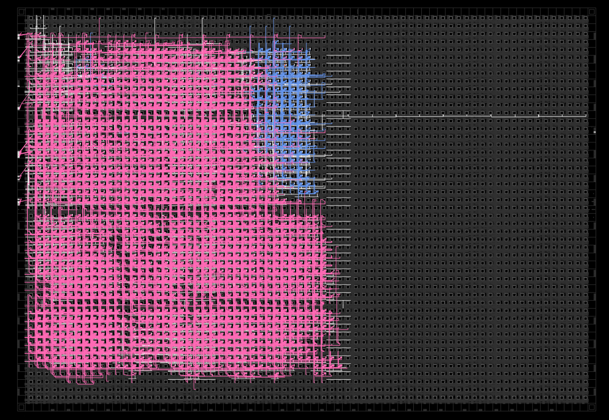

--- 
title: "03 - LiteX"
date: 2023-05-09  
author: Jonathan Bisson
id: 20230509212227
---


Using high-level languages to describe systems offers several significant advantages. They abstract away many low-level details, making the design process more intuitive and efficient. This abstraction allows designers to focus on the system's functionality and architecture, rather than getting bogged down in the minutiae of hardware specifics. High-level languages also tend to be more expressive and readable than low-level languages, facilitating better understanding and communication among team members. Furthermore, they often come with extensive standard libraries and tools, enabling rapid prototyping and debugging. Lastly, high-level languages allow for the use of advanced software engineering practices, such as object-oriented programming and automated testing, leading to more reliable and maintainable systems (well that is the theory at least).

## Migen and LiteX
Migen is a Python-based tool that aims to make digital design (including both ASIC and FPGA design) more efficient and enjoyable (yay). It was developed by the M-Labs team as an improvement over existing hardware description languages (HDLs) such as VHDL and Verilog.

Migen introduces several novel concepts and adopts many good ones from existing HDLs. It also leverages the capabilities of Python as a powerful and expressive high-level language, enabling you to write more compact, maintainable, and reusable digital designs.

Key features of Migen include:

1.  **Fragmented Hardware Description:** Migen allows hardware designs to be split into fragments that can be combined and transformed.
2.  **Powerful Language Constructs:** Migen provides powerful language constructs like generators and list comprehensions, which can simplify and improve the readability of complex hardware designs.
3.  **Python-based:** As a Python-based tool, Migen allows you to use Python's extensive standard library and third-party modules, making it easier to develop and test hardware designs.
4.  **Built-in Simulation:** Migen includes a built-in simulation environment that allows you to test your designs without needing external tools.
5.  **FPGA Flow Management:** Migen includes the MiSoC project (now called LiteX), which provides a high-level way to design system-on-chip solutions, manage the FPGA flow, and handle on-chip interconnects.

Learning Migen may require learning Python if you are not already familiar with it. However, for those comfortable with Python, Migen can provide a powerful and flexible toolset for digital design.

LiteX is an open-source Python library that provides a high-level, hardware-agnostic interface for developing digital designs for FPGAs. It was created by the Enjoy Digital team and is widely used in the FPGA community. LiteX simplifies the process of designing and deploying digital designs on FPGAs by abstracting away many of the low-level details that are often required when working directly with FPGA hardware.

LiteX includes various components that help in the development of FPGA projects, such as:

1.  Core: A Python library that provides a high-level API for describing digital circuits.
2.  SoC: An SoC (System-on-Chip) builder that allows you to create and integrate custom SoCs with various peripherals and soft processor cores.
3.  BIOS: A minimal BIOS for LiteX SoCs, which helps in the initial configuration and testing of the hardware.
4.  Build tools: A set of tools that assist in the generation of FPGA bitstreams, including wrappers for various FPGA synthesis and place-and-route tools (such as Yosys and NextPNR).

LiteX can be used with a wide range of FPGA devices and development boards, including the Lattice ECP5 that is on your board. The library is also compatible with several soft processor cores, like RISC-V and LM32, allowing users to create custom SoCs tailored to their specific needs.

## Example: An ethernet logic-analyzer in a few lines of Python
Create a file main.py
```python
#!/usr/bin/env python3

#
# This file is based on Colorlite (https://github.com/enjoy-digital/colorlite)
#
# Copyright (c) 2020-2022 Florent Kermarrec <florent@enjoy-digital.fr>
# Copyright (c) 2023 Jonathan Bisson <bjonnh-github@bjonnh.net>
# SPDX-License-Identifier: BSD-2-Clause

from liteeth.phy.ecp5rgmii import LiteEthPHYRGMII
from litescope import LiteScopeAnalyzer
from litex.build.generic_platform import *
from litex.soc.cores.clock import *
from litex.soc.cores.gpio import GPIOOut
from litex.soc.cores.led import LedChaser
from litex.soc.cores.spi_flash import ECP5SPIFlash
from litex.soc.integration.builder import *
from litex.soc.integration.soc_core import *
from litex_boards.platforms import colorlight_i5
from migen import *
from migen.genlib.misc import WaitTimer

# IOs ----------------------------------------------------------------------------------------------

#_gpios = [
#    # GPIOs.
#    ("gpio", 0, Pins("j4:0"), IOStandard("LVCMOS33")),
#    ("gpio", 1, Pins("j4:1"), IOStandard("LVCMOS33")),
#]


# CRG ----------------------------------------------------------------------------------------------

class _CRG(Module):
    def __init__(self, platform, sys_clk_freq):
        self.clock_domains.cd_sys = ClockDomain()
        # # #

        # Clk / Rst.
        clk25 = platform.request("clk25")
        #rst_n = platform.request("user_btn_n", 0)

        # PLL.
        self.submodules.pll = pll = ECP5PLL()
        #self.comb += pll.reset.eq(~rst_n)
        pll.register_clkin(clk25, 25e6)
        pll.create_clkout(self.cd_sys, sys_clk_freq)


# ColorLite ----------------------------------------------------------------------------------------

class ColorLite(SoCMini):
    def __init__(self, sys_clk_freq=int(50e6), with_etherbone=True, ip_address=None, mac_address=None):
        platform = colorlight_i5.Platform(revision="7.0")

        # CRG --------------------------------------------------------------------------------------
        self.submodules.crg = _CRG(platform, sys_clk_freq)

        # SoCMini ----------------------------------------------------------------------------------
        SoCMini.__init__(self, platform, clk_freq=sys_clk_freq)

        # Etherbone --------------------------------------------------------------------------------
        if with_etherbone:
            self.submodules.ethphy = LiteEthPHYRGMII(
                clock_pads=self.platform.request("eth_clocks"),
                pads=self.platform.request("eth"),
                tx_delay=0e-9)
            self.add_etherbone(
                phy=self.ethphy,
                ip_address=ip_address,
                mac_address=mac_address,
                data_width=32,
            )

        # artificial signal
        count = Signal(8)
        #rst_n = platform.request("user_btn_n", 0)
        self.sync += count.eq(count + 1)
        analyzer_signals = [
            count,
        #    rst_n
        ]
        self.submodules.analyzer = LiteScopeAnalyzer(analyzer_signals,
            depth=1024,
            clock_domain="sys",
            samplerate=self.sys_clk_freq,
            csr_csv="analyzer.csv"
        )
        self.add_csr("analyzer")

        # GPIOs ------------------------------------------------------------------------------------
        #platform.add_extension(_gpios)

        # Power switch
        #power_sw_pads = platform.request("gpio", 0)
        #power_sw_gpio = Signal()
        #power_sw_timer = WaitTimer(2 * sys_clk_freq)  # Set Power switch high after power up for 2s.
        #self.comb += power_sw_timer.wait.eq(1)
        #self.submodules += power_sw_timer
        ##self.submodules.gpio0 = GPIOOut(power_sw_gpio)
        #self.comb += power_sw_pads.eq(power_sw_gpio | ~power_sw_timer.done)

        # Reset Switch
        #reset_sw_pads = platform.request("gpio", 1)
        #self.submodules.gpio1 = GPIOOut(reset_sw_pads)


# Build --------------------------------------------------------------------------------------------

def main():
    parser = argparse.ArgumentParser(description="Take control of your ColorLight FPGA board with LiteX/LiteEth :)")
    parser.add_argument("--build", action="store_true", help="Build bitstream")
    parser.add_argument("--load", action="store_true", help="Load bitstream")
    parser.add_argument("--ip-address", default="10.0.0.42",
                        help="Ethernet IP address of the board (default: 10.0.0.42).")
    parser.add_argument("--mac-address", default="0x726b895bc2e2",
                        help="Ethernet MAC address of the board (defaullt: 0x726b895bc2e2).")
    args = parser.parse_args()

    soc = ColorLite(ip_address=args.ip_address, mac_address=int(args.mac_address, 0))
    builder = Builder(soc, output_dir="build", csr_csv="csr.csv")
    builder.build(build_name="colorlite", run=args.build)

    if args.load:
        prog = soc.platform.create_programmer()
        prog.load_bitstream(os.path.join(builder.gateware_dir, soc.build_name + ".svf"))

if __name__ == "__main__":
    main()
```
## Build

```shell
python3 main.py --build
```

## Upload
```shell
openFPGALoader -b "colorlight-i5" --freq "16000000" ./build/gateware/colorlite.svf
```

## Run
Check that you can ping your board (edit the main.py file and rebuild if you don't like the default IP)
```shell
ping 10.0.0.42
```

Run the litex server
```shell
litex_server --udp --udp-ip=10.0.0.42
```

Start an acquisition:
```shell
litescope_cli -r --dump dump.sr
```

Once you press the button on the device, it will trigger the logic analyzer and save a file `dump.sr` with the signals.

You can view it using tools like sigrok-cli or gtkwave:

```shell
sigrok-cli -i dump.sr -O ascii
```

You can see a demo video below:
[](https://kraut.zone/w/k2qy5PXbBuHhozcDf9QgbP)

## How much does it take on the chip

In pink, ethernet, in blue the analyzer and its memory.


