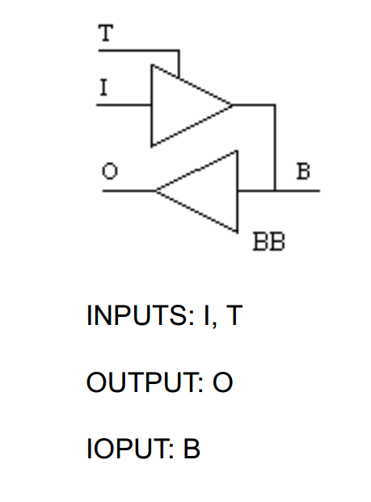
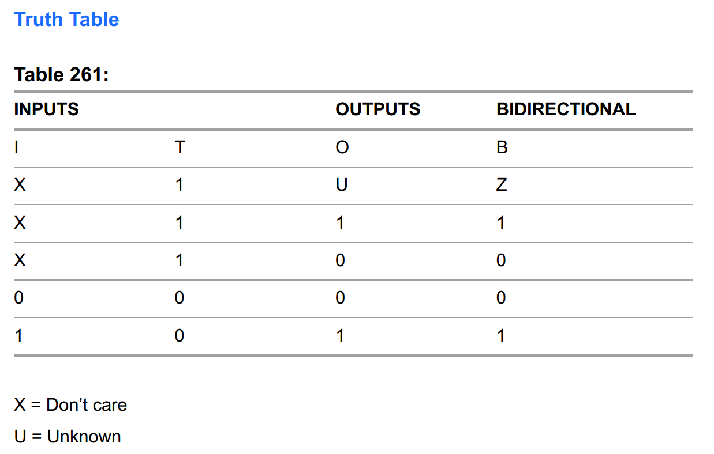
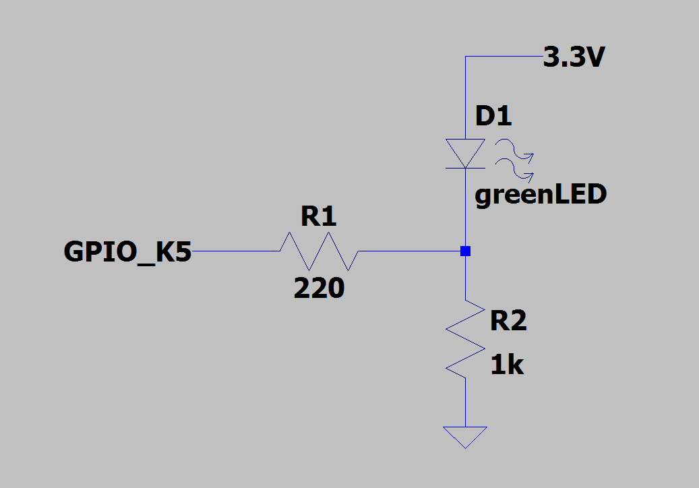
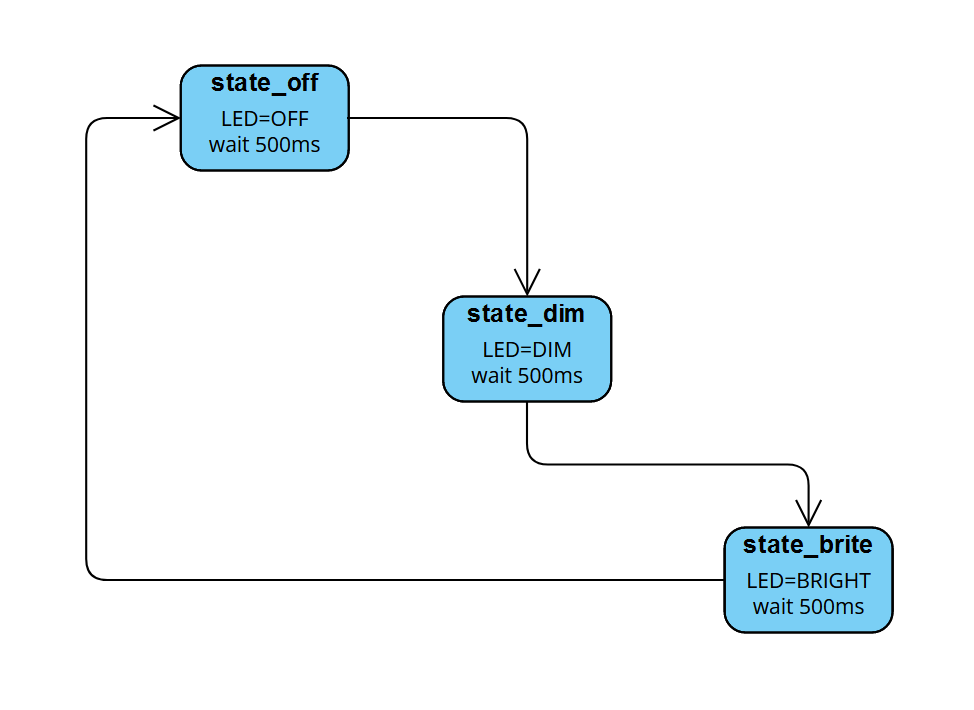

## Tri-state buffers
Logic states in verilog can not only take on the binary values of one and zero, but there is a valid "third" state called high-Z (or high impedance).  This is a fancy way of saying disconnect something completely, i.e. an open circuit.

To highlight this, let's take a 1-bit wire that is presumably connected to an output pin with nothing else connected to it.  We can set it to any of these 1-bit constants.

```verilog
wire tri_test = 1'b0;	// the voltage at this pin would be 0 volts
wire tri_test = 1'b1;	// the voltage here would be 3.3 volts
wire tri_test = 1'bz;	// voltage here...is not well defined; the pin is "floating"
```

This is called a tri-state buffer.  These are typically used on bidirectional data buses with one or more devices attached.  When a single device on the bus wants to put data out onto the bus, all the other connected devices must put their data lines into "high-Z", or put another way, "tri-state" their outputs.
If they don't do this properly, then the bus is in "contention" and can result in funky operation and/or damage.  The opposite can also happen where the bus is completely floating and can give erronous
values unless something "pulls" it up/down to a high/low state.

Although using `z` in verilog is perfectly valid, the Yosys open-source synthesis tools currently don't support translating something like `1'bz` onto a GPIO pin.  You'll get a warning that looks like this:
`Warning: Yosys has only limited support for tri-state logic at the moment.`

However, since verilog is only our higher level "C code" for describing FPGA behavior, we can drop down to use the "inline assembly" of describing this same behavior.
The language FPGAs use for its low-level building blocks are called the "device primitives".  Lattice has a document describing the primitives for many of its FPGA devices and [it can be found here.](https://www.latticesemi.com/-/media/LatticeSemi/Documents/UserManuals/EI2/fpga_library_D311SP3.ashx?document_id=52656)


We're interested in the `BB` primitive which they call "**CMOS Input 6mA Sink 3mA Source Sinklim Output Buffer with Tristate – BiDirectional**".  They give the following schematic representation and truth table:

---



---



---

If we want to instantiate this primitve in our code, [the sysI/O usage guide](https://www.latticesemi.com/view_document?document_id=50464) gives a verilog example as such:
```
BB buf7 (.I(Q_out7), .T(Q_tri7), .O(buf_Data7), .B(Data[7]));
```

This wasn't covered previously, but when instantiating a module (any module) you can list the instance ports in the same order as the module definition. Or you can do what they did here where the port name within the module is called out with a dot in front of it and the instance port is in parentheses next to it. This creates a mapping where things can be out of order, or you can leave unused ports out if you don't need them.  It also reduces the chance of making a mistake in the ordering.


## Finite state machines

Building a state machine is a fundamental exercise in FPGA design.  All CPUs use some kind of state machine as the basis of how they operate and execute instructions.
The clock signal moves the machine forward through its states 
We first need to define our states and describe how we want to allow them to move between each other.  We'll make a project where we hook up a single GPIO pin (FPGA-pad K5 as coded in this example) as such:



and we'll make that pin a tri-state output and define all three states.  When the pin is a one (3.3V), the LED should turn off completely because all the current is flowing between the pin and ground, i.e. we're shorting across the LED.
When the pin is a zero (0V), the LED is on and quite bright because current flows through the parallel combination of both resistors (~180ohm) since they're both connected to 0V (ground).
And finally, when the pin is high-Z it is disconnected so the LED is still on but current is only flowing through the 1k resistor and will therefore be much dimmer.  So we have three states we can move between.
```verilog
localparam state_off = 2'b00;
localparam state_dim = 2'b01;
localparam state_brite = 2'b10;
reg [1:0] led_state = state_off;
```
The **localparam** keyword is typicaly a good choice for defining constant values within a module.  There are other ways but we won't cover them now.
Since there are 3 valid states, we need at least two bits to cover that many states.  Therefore, our defined states and state register are all 2-bits.


We'll use a clock for this state machine which yields us a 100ms period, so we divide the 25MHz by 2500000:
```verilog
clkdiv #(.DIV(2500000)) slowclk(
	.clk_i(clk), 
	.clk_o(baseclk));
```

Lastly, we want to be able to control how long we're in each state.  To keep it simple, we'll use the same time between each state.
```verilog
localparam state_time = 5;
reg [7:0] counter = state_time;
```

The best way to manage our states is to use [the verilog case statement](https://www.hdlworks.com/hdl_corner/verilog_ref/items/CaseStatement.htm).
Our state register is the "expression" for the case, and our predefined state names are what's populated for each case.  It's important to populate the **default** case so the machine never gets "stuck".
So we'll just copy the code for **state_off** into **default**.

The state machine is structured such that the initial state is off, then it proceeds to the dim state, and then the bright state before it loops back to the off state and repeats indefinitely.
The **enable** register is what we use to put the output into the high-Z state.  When **enable** is high, we don't care what **led** is set to.  The following diagram shows a visual representation of this very basic state machine.



## The Code
At this point, let's just see the code in its entirety:

**blink_zed.v**
```verilog
module top(input wire clk, output wire led_pin);
	wire baseclk;
	reg led;
	reg enable;
	
	// set up state names and initialize the state
	localparam state_off = 2'b00;
	localparam state_dim = 2'b01;
	localparam state_brite = 2'b10;
	reg [1:0] led_state = state_off;
	
	// divide input 25MHz clock to get a period of 100ms (10Hz)
	clkdiv #(.DIV(2500000)) slowclk(
			.clk_i(clk), 
			.clk_o(baseclk));
	
	// set up delay counter for the state machine
	// each clock period is 100ms so total wait time is 500ms
	localparam state_time = 5;
	reg [7:0] counter = state_time;
	
	// the actual state machine
	always @(posedge baseclk) begin
	case (led_state)
		state_off: begin
			enable = 1'b1;
			led <= 1'b1;
			counter <= counter - 1;
			if (counter == 0) begin
				counter <= state_time;
				led_state <= state_dim;
			end
		end
		state_dim: begin
			enable = 1'b0;
			led <= 1'b1;
			counter <= counter - 1;
			if (counter == 0) begin
				counter <= state_time;
				led_state <= state_brite;
			end
		end
		state_brite: begin
			enable = 1'b1;
			led <= 1'b0;
			counter <= counter - 1;
			if (counter == 0) begin
				counter <= state_time;
				led_state <= state_off;
			end
		end
		default: begin
			enable = 1'b1;
			led <= 1'b1;
			counter <= counter - 1;
			if (counter == 0) begin
				counter <= state_time;
				led_state <= state_dim;
			end
		end
	endcase
	end
	
	// primitive for bi-directional buffer which allows tri-stating
	BB tristate_out (.I(led), .T(~enable), .B(led_pin));
	
endmodule


module clkdiv #(parameter DIV = 24'd5000)(
    input wire clk_i,
    output wire clk_o
    );

    reg [24:0] count = 25'b0;
    reg clk_o_internal = 1;
    //on this board we have a 25MHz clock

    always @(posedge clk_i) begin
        count <= count + 25'b1;
        if(count == DIV) begin
            count <= 25'b0;
            clk_o_internal <= ~clk_o_internal;
        end
    end
    assign clk_o = clk_o_internal;
endmodule
```

The only portion of the above code not fully discussed yet is the `BB tristate_out` instance.  A couple things to note.
First, the **T** port is like an active-low enable input, so our enable signal is being inverted with the leading tilde (~) character.
Also worth mentioning is that the **O** port is not used here so we don't have to connect anything to it.

<br>

**blink_zed.lpf**
```verilog
LOCATE COMP "clk" SITE "P3";
IOBUF PORT "clk" IO_TYPE=LVCMOS33;
FREQUENCY PORT "clk" 25 MHZ;

LOCATE COMP "led_pin" SITE "K5";
IOBUF PORT "led_pin" IO_TYPE=LVCMOS33 DRIVE=12;
```

A bonus tidbit here is the **DRIVE** attribute which sets the drive strength of an output pin.  There is much more info in the [the sysI/O usage guide](https://www.latticesemi.com/view_document?document_id=50464), but the general jist of it is that you can set it between 4, 8, 12, and 16.  What this does in practice is change the ON resistance of the transistors driving the output.  A higher value of drive strength results in lower ON resistance, which means the effective series resistance of your output is lower and therefore you can push/pull more current out/in of the pin while maintaining valid logic levels at the receiving device(s).

## Build

```shell
yosys -p "synth_ecp5 -top top -json blink_zed.json" blink_zed.v
nextpnr-ecp5 --json blink_zed.json --textcfg blink_zed_out.config --25k --package CABGA381 --lpf blink_zed.lpf
ecppack --compress --svf blink_zed.svf blink_zed_out.config blink_zed.bit
```


## Upload

```shell
ecpdap program blink_zed.bit
```

OR

```shell
sudo $HOME/oss-cad-suite/libexec/openFPGALoader -b "colorlight-i5" --freq "16000000" blink_zed.svf
```


## Exercice
- [ ] Make the led change state faster
- [ ] Make the led change state slowweeerrrr
- [ ] Make the led stay on longer when bright and shorter when dim
- [ ] Change the order of the states such that it's dim->off->bright
- [ ] Change the state based on a push-button input instead of clock time
